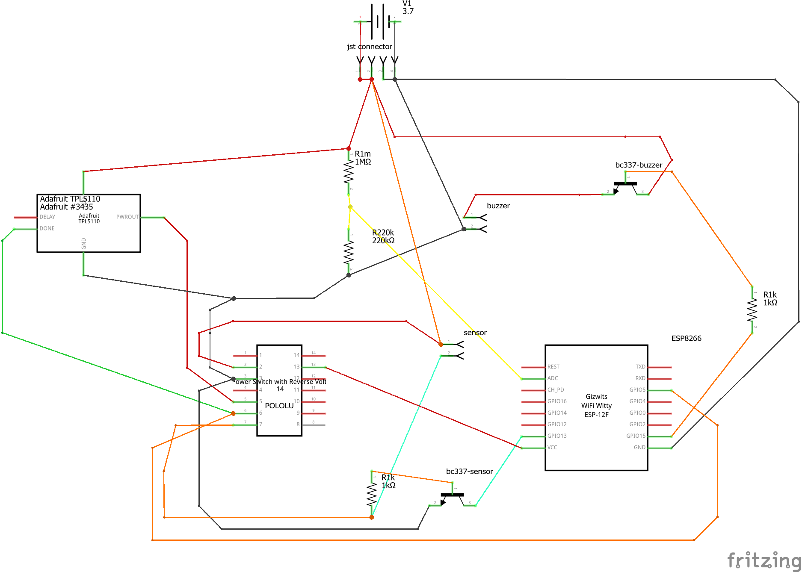

# Wireless, Battery-Powered, Water Detector
A water detector powered by a LiPO batteries and transmits its status and notifications via MQTT to Home Assistance.

## About
A while back my indoor air conditioner air handler's condensation pipe clogged and caused a small flood. Thankfully we were home and so it didn't cause much damage. So instead of being sensible and getting a $15 water alarm from Home Depot, I decided to spend an inordinate amount of time, money, and effort into creating a water alarm device I could put anywhere and  notify me if a water leak happens again. My version will not only screech an annoying pitch at me but will also send me a notification to my Home Assistant which will them let me know via phone and email. Oh.. and it should run on a 2500 mAh LiPO battery for about 2439 hours or around 101 days and 15 hours (according to http://www.of-things.de/battery-life-calculator.php)

## Main Features
* Battery powered - No need to run power cables to power device. Battery can last for several months before recharging
* WifI Enabled - Sends MQTT notifications to my Home Assistant server
* Battery Level Warnings - Noitfies me when battery is low
* Small and Easy to Install - Simply plug battery and set where water ought not to be

## Pictures

## Hardware Needed
* ESP8266 12E or F (https://www.amazon.com/gp/product/B01M4IOFIT)
* ESP8266 Serial Port WiFi Module Adapter Plate (https://www.amazon.com/gp/product/B01NCQFSEG)
* 2500mAh LiPO battery (https://www.adafruit.com/product/328)
* FTDI Mini USB to TTL Serial Converter Adapter Module to program ESP (https://www.amazon.com/gp/product/B00IJXZQ7C/)
* Low Power Labs' TPL 5110 (https://lowpowerlab.com/shop/product/147?search=tpl5110) or Adafruit TPL5110 (https://www.adafruit.com/product/3435)
* Pololu Mini Pushbutton Power Switch with Reverse Voltage Protection (https://www.pololu.com/product/2808)
* JST Connectors (https://www.amazon.com/gp/product/B07449V33P)
* 5v DC Buzzer (https://www.amazon.com/gp/product/B0716FD838)
* 1 - 220k ohm resistor and 1 - 1m ohm resistor (To divide voltage from battery and calculate its capacity with the ESP's ADC pin.)
* 2 - 1 k ohm resistors
* 1- 150k to 170 k ohm resistor to control the TPL5110 delay. This one is needed if using Low Power Lab's TPL5110. Adafruit's TPL has an adjustable potentiometer to control the delay.
* 2 - BC337 NPN transistors 
* Rust-proof water probes (https://www.amazon.com/gp/product/B07L94MMP)

## Circuit Diagram

### Circuit Explanation
The battery powers the TPL5110 and the Pololu switch directly. The TPL is the timer that will wake up the ESP (by sending an ON signal to the Pololu switch which then turns on the ESP) at specific intervals to read the battery voltage and send an MQTT message with its status (voltage % and raw ADC value as well as the previous and current sensor status). Right now I have it set to run every 90 minutes or so.
The Pololu switch reads the status of the porbes and turns the ESP on if the sensor probes signal closes (water or something else makes contact with the probes and closes the circuit). 

The ESP's ADC pin is 1 volt so I use the 1m ohm and 220k ohm resistors to divide the voltage to lessa than 1v before it is read by the ADC. (More at https://learn.adafruit.com/using-ifttt-with-adafruit-io/wiring#battery-tracking)

When the ESP's sketch is done it sends a signal to the DONE pin of both the TPL and the Pololu circuits, causing them to cut power to the ESP.

When dormant, the whole project draws about 8 micro amps. When the EPS is turned on the sketch takes about 10 seconds to run and consumes an average of about 82 milliamps.

#### Potential for more battery savings
The battery may last a lot longer than 100 days if I update my code to send the MQTT notifications every x number of times it wakes up. The TPL has a maximum delay of 2 hours, but I don't need to check the battery voltage that often. I can set a counter to actually send the message every 12 times it runs, thus sending the notification once per day (or maybe two days, etc). This will increase the battery life pretty dramatically. However, since I am still testing the system, I am not using this feature yet.

## Soldering and Programming the Barebones Board
The following video shows how to solder the ESP to the plate and how to program it using the Arduino IDE: https://www.youtube.com/watch?v=O2SSyfP6OM0

## Code
The code can be found in the included ino file.

## Enclosure
I designed the enclosure using Fusion360. You can view and download it here https://a360.co/2OCKjhl
I printed it with a Prusa MK3 using PLA.(https://www.youtube.com/embed/VsiMdKhxB_E)

